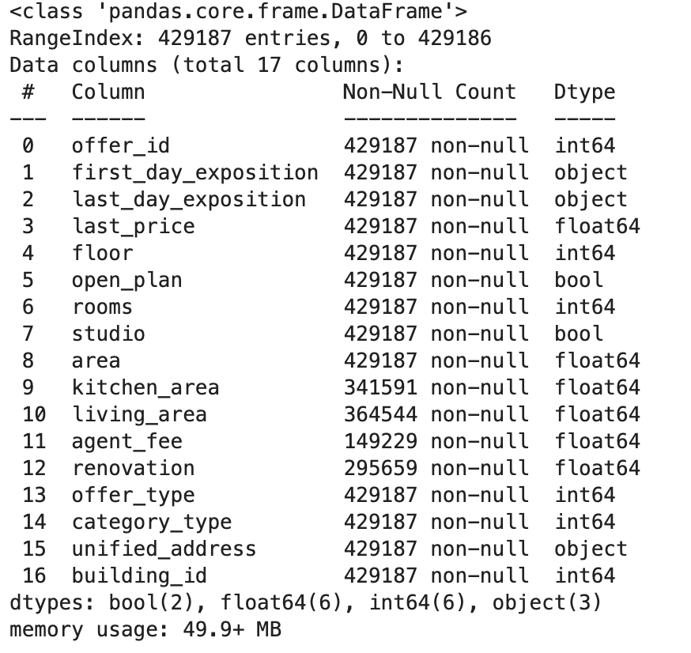
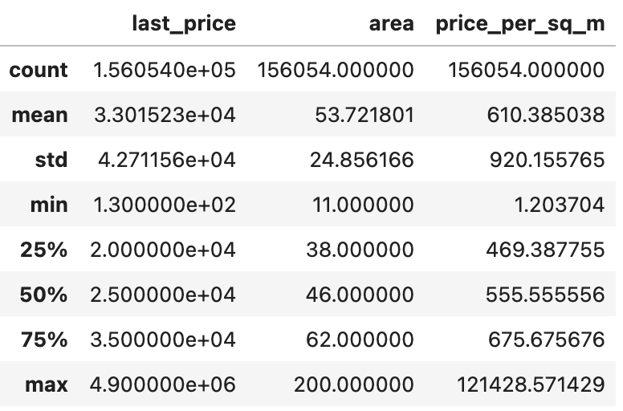
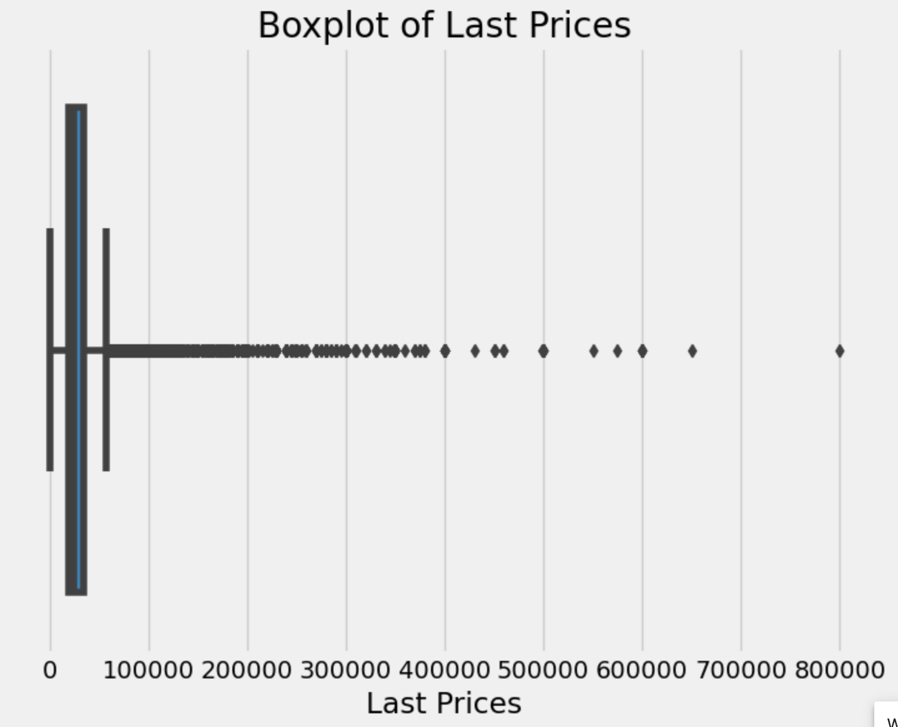
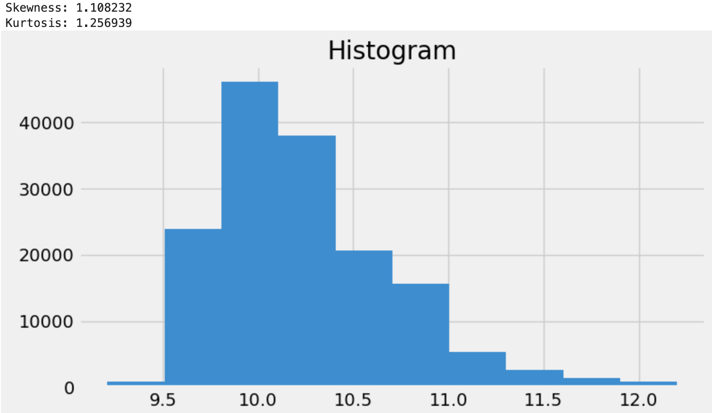

# Final Project
# "Predicting Real Estate Data in St. Petersburg"

### Project Description
**Project goal**: real estate price forecasting in St. Petersburg

This project aims to analyze real estate data in St. Petersburg based on data from Yandex.Real Estate listings containing apartment listings from 2016 to mid-August 2018. 
In the course of the work was carried out: 
1) EDA data analysis plotting on the obtained data. 
2) Training of the model for predicting apartment prices
3) Transferring the data to a remote machine and creating a web application using Flask for easy access to the forecasts.
4) Using Docker to containerize the application, ensuring it can run on different environments without modification. 

## Baseline data and statistics ##

**Data source:** [realty.yandex.ru](https://realty.yandex.ru)

**EDA**

The data initially contained 429187 rows and 17 columns. Below is the info() about our raw table: 



Column information:
1. **offer_id**: Unique identifier of the real estate offer/offer.
2. **first_day_exposition**: The date the offer was first posted.
3. **last_day_exposition**: The date the offer was last posted.
4. **last_price**: The last price of the property.
5. **floor**: The floor on which the property is located.
6. **open_plan**: Flag indicating if the layout is open.
7. **rooms**: The number of rooms in the property.
8. **studio**: Flag indicating if the property is a studio. 9. area: The total area of the property.
9. **area**: The total area of the property.
10. **kitchen_area**: The area of the kitchen.
11. **living_area**: Living area.
12. **agent_fee**: Agent's commission.
13. **renovation**: Renovation costs.
14. **offer_type**: 2 - RENT, 1 - SELL 
15. **category_type**: Category type.
16. **unified_address**: The unified address of the property.
17. **building_id**: Unique building identifier.

**We divided the table into two: the first with all rental information, the second with sales information.** 

Total rent data size: 171186

Total sell data size: 258001

### DataFrame about rent 
Prepare dataframe with rent data in city limits: 

```
rent_df = spb_df[spb_df.offer_type == 2].copy()
rent_df_spb = rent_df[rent_df.unified_address.str.contains('Россия, Санкт-Петербург')].copy()
 ````

The shape of this table is (156054, 17)

Description of important numerical attributes: 



For better analytics, 2 columns were added: **price_per_sq_m** and **house_price_sqm_median** 

Outliers in the 'last price' column: 

Conclusion: we need to logarithm this column

To evaluate the **“last price”** column, let's introduce the **“visualize_property”** function, which is designed to visualize a single numeric attribute in a DataFrame . It creates plots to help understand the distribution and characteristics of the attribute.

1. Histogram plot: Shows the distribution of the feature values using a histogram, which helps you see how the feature values are distributed over a range.

2. QQ plot: This plot is used to compare the distribution of the trait values with a normal distribution. If the points on the plot lie close to a straight line, it indicates a normal distribution.

3. Box plot: It shows the distribution of the feature values as well as the presence of outliers.

After plotting these plots, the function also outputs skewness and kurtosis, which are measures of skewness and kurtosis respectively.

```
def visualize_property(df, feature):
    fig, axs = plt.subplots(3, figsize=(8, 15))
    # Histogram plot
    axs[0].set_title('Histogram')
    df[feature].hist(ax=axs[0])
    # QQ plot 
    axs[1].set_title('QQ')
    stats.probplot(df[feature], plot=axs[1])
    # Box plot
    axs[2].set_title('Box plot')
    sns.boxplot(df[feature], ax=axs[2], orient='h')
    print("Skewness: %f" % df[feature].skew())
    print("Kurtosis: %f" % df[feature].kurt())
```

Before we applied log transformation on the **“last price”** column this function showed these results:

Skewness and kurtosis decreased, distribution became normal.



The QQ has gotten better too

Before:


After:


Before:


After: 


**Missing values**


**Deleting columns that have no meaning to us:**
'offer_id', 'price_per_sq_m' , 'house_price_sqm_median','category_type', 'offer_type'

Explore relations between 'last_price' and 'area'


## Machine learning model

**Necessary libraries for modeling:**

```
from sklearn.tree import DecisionTreeRegressor, plot_tree
from sklearn import metrics 
from sklearn.ensemble import RandomForestRegressor
from sklearn.model_selection import train_test_split
from sklearn.preprocessing import StandardScaler
from sklearn.model_selection import train_test_split
```

Before creating the model, make sure all the data is prepared. The data looks like this:


**Splitting data:** 

```
X = df[['open_plan', 'rooms', 'area', 'renovation']]
y = df['last_price']
df = pd.concat([X, y], axis=1)

X_train, X_test, y_train, y_test = train_test_split(df[['open_plan', 'rooms', 'area', 'renovation']], df['last_price'], test_size=0.2, random_state=42)
X_train, X_val, y_train, y_val = train_test_split(X_train, y_train, test_size=0.25, random_state=42) # 0.25 * 0.8 = 0.2, разделение 60-20-20

df_training = pd.concat([X_train, y_train], axis=1)
df_validation = pd.concat([X_val, y_val], axis=1)
df_test = pd.concat([X_test, y_test], axis=1)
```

Training sample size: (93234, 5)

Validation sample size: (31079, 5)

Test sample size: (31079, 5)

**Standardization:**

```
from sklearn.preprocessing import StandardScaler

y_train = np.array(y_train).reshape(-1, 1)
y_val = np.array(y_val).reshape(-1, 1)

sc_X = StandardScaler()
sc_y = StandardScaler()

X_train = sc_X.fit_transform(X_train)
X_val = sc_X.transform(X_val)  # используйте transform для валидационного набора данных
y_train = sc_y.fit_transform(y_train)
y_val = sc_y.transform(y_val.reshape(-1, 1))  # используйте transform для валидационного набора данных
```
**Model training using decision trees:** RandomForestRegressor model, which is an ensemble method based on decision trees. The model has been trained on a training dataset for predicting apartment prices.

    MAE: 0.36450180897542317
    MSE: 0.3659391242188636
    RMSE: 0.6049290241167666


**Model training with CatBoost:** CatBoostRegressor model, which is a gradient bousting method. This model has also been trained on a training dataset to predict the cost of apartments.

    MAE: 0.3643808046785357
    MSE: 0.36586152077406886
    MSE: 0.604864878112516


Hyperparameter tuning with GridSearchCV: GridSearchCV to tune the hyperparameters of the RandomForestRegressor model. This means that different combinations of hyperparameter values were tried and the performance of the model on each set of values was evaluated. The best hyperparameters were then used for the final model.

```
from sklearn.model_selection import GridSearchCV

param_grid = {
    'n_estimators': [10, 20, 30, 50, 100, 200],
    'bootstrap': [True, False],
    'max_depth': [5, 10, 15], 
    'min_samples_split': [2, 3, 4], 
    'max_features': [1, 2, 3]
}

random_forest_model = RandomForestRegressor()

grid_search = GridSearchCV(random_forest_model, param_grid, cv=5)
grid_search.fit(X_train, y_train.ravel())

best_params = grid_search.best_params_
print(best_params)
```

